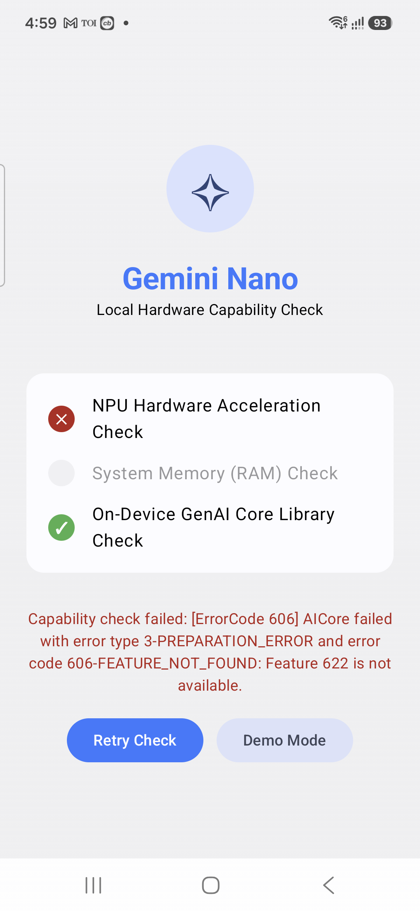
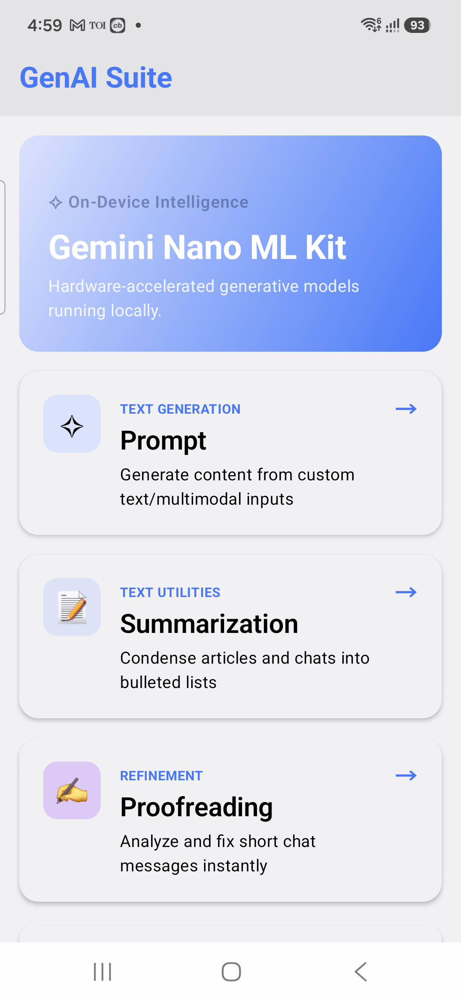
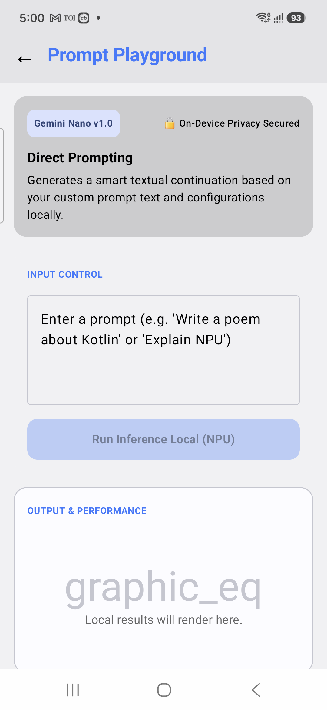

# Gemini Nano On-Device AI Playground

This is a native Android application built with **Jetpack Compose** demonstrating local, on-device Generative AI capabilities powered by **Gemini Nano** and the **Android AICore system service** using **Google's ML Kit GenAI client SDKs**.

---

## Screenshots

Here are the screenshots showing the application interface and features:

| 1. Splash Screen Check | 2. Main Dashboard | 3. Playground Feature |
| :-: | :-: | :-: |
|  |  |  |

---

## Core Architecture & Design Patterns

The application conforms to strict architectural boundaries ensuring modularity, privacy, and decoupled logic.

### 1. Presentation Layer: Strict MVI Data Flow
Every screen in the `ui/` package is structured with a decoupled, unidirectional data flow contract:
- **State**: An immutable data class representing the complete UI state.
- **Intent**: A sealed interface representing user actions or business triggers sent to the ViewModel.
- **Effect**: A one-shot side-effect channel used for one-time events like navigation or toast alerts.

### 2. Domain & Data Layer: Clean Repository Pattern
All interactions with on-device generative models are extracted into a dedicated Repository layer:
- **[GeminiNanoRepository](app/src/main/java/android/ai/gemininano/data/repository/GeminiNanoRepository.kt)**: The core interface defining suspending functions for the generative tasks.
- **[GeminiNanoRepositoryImpl](app/src/main/java/android/ai/gemininano/data/repository/GeminiNanoRepositoryImpl.kt)**: The concrete implementation wrapping ML Kit SDK builders, client engines, flow collections, and error handling.
- **ViewModel Decoupling**: ViewModels hold references to the repository interface rather than importing direct ML Kit SDK dependencies, keeping presentation logic completely platform-agnostic.

---

## On-Device Generative Features

The playground supports six local AI operations:
1. **Custom Prompt**: Execute custom text generation using local Gemma/Gemini Nano models.
2. **Summarization**: Condense long articles or text blocks into bullet-point lists with input/output optimizations.
3. **Proofreading**: Correct grammar/spelling errors on-device and map differences into visual diff segments (ADDED, DELETED, UNCHANGED).
4. **Rewriting**: Rephrase text dynamically matching custom tone (Professional, Casual, Concise) and length constraints.
5. **Image Description**: Perform local multimodal vision processing to generate text-based descriptions from images.
6. **Speech Recognition**: Transcribe voice recordings directly on-device using a local Whisper-based ML engine.

---

## Error Handling & Hardware Constraints
- **AICore Compatibility Check**: On startup, the splash screen verifies NPU acceleration capabilities, RAM limits, and AICore binding.
- **No Silent Fallbacks**: If the device hardware does not support generative features, the catch block intercepts the failure and directly logs the actual platform error under the title `"Device is not supported"`.
- **Demo Mode**: Users can explicitly run the app in **Demo Mode** to experience simulated generations and UI flows on unsupported emulators or devices.

---

## Build & Run

### Prerequisites
- **Android Studio** Ladybug or newer.
- **Android SDK** version 35 (API level 35).
- A compatible device (e.g., Pixel 8+, Samsung Galaxy S24+) with **AICore** enabled.

### Compilation
Compile the project from the root folder:
```bash
./gradlew compileDebugKotlin
```
